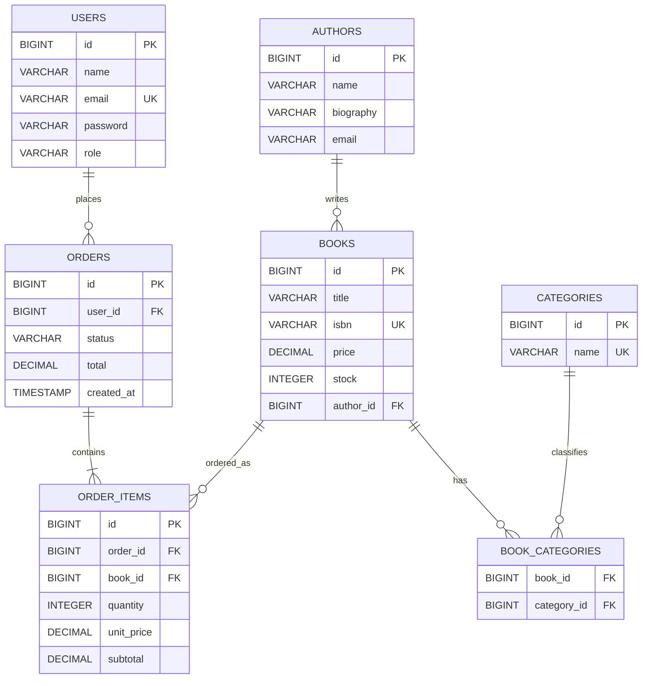

# Diagrama ER

## Relaciones

- Un autor puede tener muchos libros.
- Un libro pertenece a un autor.
- Un libro puede estar asociado a muchas categorias.
- Una categoria puede estar asociada a muchos libros.
- Un usuario puede realizar muchos pedidos.
- Un pedido pertenece a un usuario.
- Un pedido contiene uno o mas items.
- Cada item de pedido referencia un libro.
